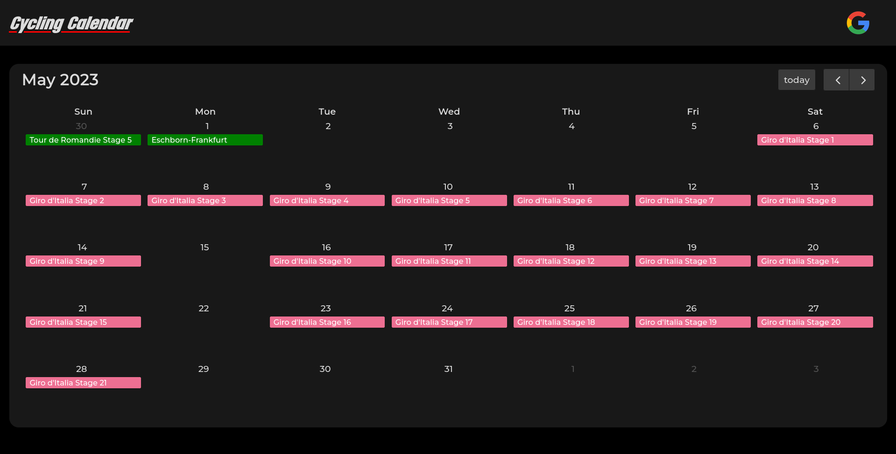
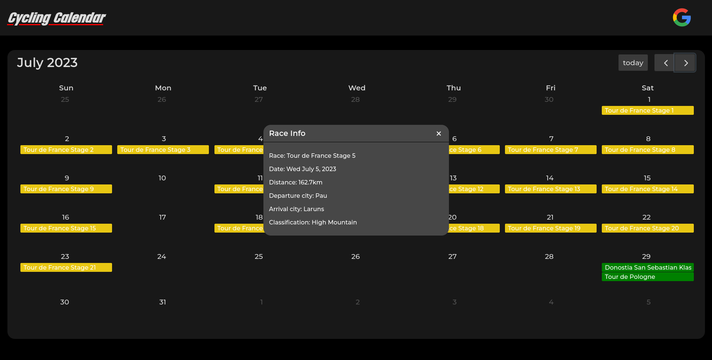

# Cycling-calendar

My first programming project, a straightforward web application that presents professional cycling races scheduled for the 2023 season in a calendar format.

## Screenshots

  
Image 1

  

  
Image 2

  

## Resources used

- **Flask**: Backend framework.
- **Sport radar api**: To retrieve the data, see [here](https://developer.sportradar.com/docs/read/Home).
- **FullCalendar**: JavaScript library for creating the calendar view, see [here](https://fullcalendar.io/)
- **Google api**: Integration for adding races to the user's calendar. Google OAuth2 is used for authentication with the Google Calendar API.

## What I learned with this project

- Building a web application with Flask.
- Developing the frontend using HTML, CSS, and JavaScript.
- Utilizing the FullCalendar JavaScript library.
- Retrieving data from an external api.
- Caching data for faster rendering.
- Implementing the Google Calendar API to add events.
- Configuring OAuth2 for Google authentication.
